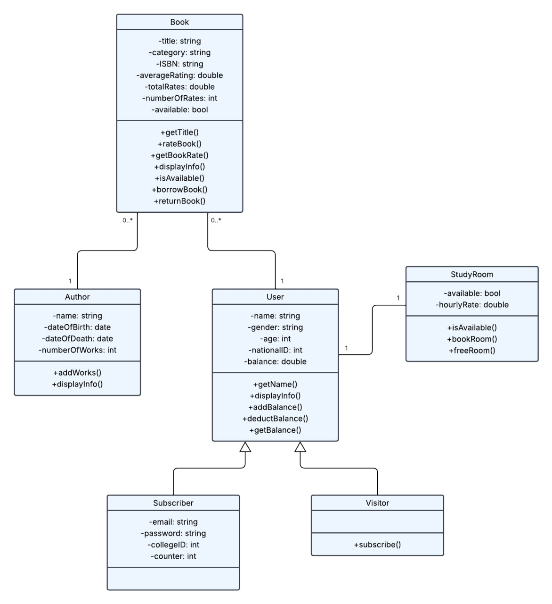

# Library Management System

Welcome to the Library Management System — a simple, console-based C++ application designed for efficient library operations, including book management, user subscriptions and study room reservations.

## Features

- System Users:
  - Subscriber: unique account with ID.
  - Visitor: Temporary access with option to subscribe.
- User Balance Management: Balance management (add/deduct funds).
- Book Management: Borrow, return and rate books.
- Searching: Search for subscribers or books in the system.
- Study Room Booking: Reserve/free study rooms.

## System Architecture

### **Class Diagram Overview**

##  Getting Started

### Prerequisites
- C++17 compiler (GCC, Clang, or MSVC)
- CMake (optional, for building)

### Installation
git clone <https://github.com/emannhassan/Library-Management-System>
cd Library-Management-System
make build
./bin/library_system